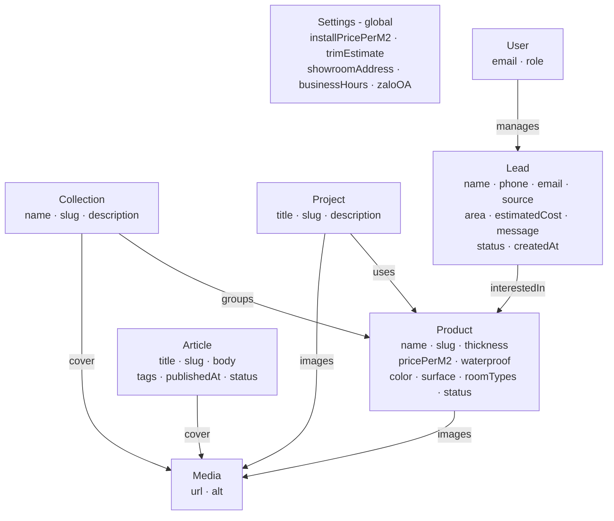

# Class Diagram (Domain Model) — Website Sàn Gỗ FUKIONE (Phase 1)

**Ngày:** 2026-06-20
**Phạm vi:** Phase 1 — B2C lead-gen, Hà Nội
**Liên quan:** `2026-06-20-fukione-phase1-srs.md` (§4 Dữ liệu), `2026-06-20-fukione-phase1-usecases.md`

> Sơ đồ **tối giản**: chỉ thể hiện thực thể, thuộc tính cốt lõi và quan hệ. Không liệt kê hàm/CRUD (đã có ở use case).

---

## 1. Sơ đồ lớp (Domain Model)

> Vẽ bằng `flowchart` thay cho `classDiagram` để tương thích viewer (một số viewer không render được classDiagram). Mỗi ô = một thực thể + field cốt lõi; mũi tên = quan hệ. **Lực lượng (cardinality)** xem bảng §3.

> Các trường kiểu enum (`source`, `status`, `role`) để kiểu `string`; **giá trị hợp lệ** liệt kê ở §2.1. `Settings` là cấu hình toàn cục độc lập (không quan hệ FK).

---

## 2. Thực thể (Entities)

Hệ thống Phase 1 có **8 thực thể** (3 nhóm giá trị enum mô tả ở §2.1):

| # | Thực thể | Vai trò | Sinh ra từ use case |
|---|---|---|---|
| 1 | **Product** | Sản phẩm sàn gỗ (52 mã) | UC-01..07, UC-24 |
| 2 | **Collection** | Bộ sưu tập nhóm sản phẩm theo concept/phòng | UC-11, UC-27 |
| 3 | **Article** | Bài viết blog (SEO + thu lead) | UC-12, UC-25 |
| 4 | **Project** | Công trình thực tế đã thi công (trust) | UC-13, UC-26 |
| 5 | **Lead** | Khách tiềm năng + mini-CRM | UC-08, UC-09, UC-18..22 |
| 6 | **Settings** | Cấu hình toàn cục: giá lắp đặt, NAP, showroom, Zalo | UC-07, UC-29 |
| 7 | **User** | Tài khoản nội bộ (Admin/Editor/Sale) | UC-17, UC-30 |
| 8 | **Media** | Ảnh dùng chung (upload) | gắn vào SP/dự án/bài viết |

### 2.1 Giá trị enum (lưu kiểu `string`, ràng buộc ở tầng ứng dụng)

| Trường | Thực thể | Giá trị hợp lệ |
|---|---|---|
| `source` | Lead | `calculator` · `survey` · `quote` · `zalo` |
| `status` | Lead | `new` · `contacted` · `quoted` · `won` · `lost` |
| `role` | User | `admin` · `editor` · `sale` |

> Để gọn & tương thích mọi viewer, sơ đồ không vẽ class `<<enumeration>>`; các giá trị trên được kiểm soát bằng Zod/Payload select ở code.

---

## 3. Quan hệ (Relationships)

| Quan hệ | Loại | Lực lượng | Ý nghĩa |
|---|---|---|---|
| Collection → Product | Aggregation | 1 ── 0..* | Một bộ sưu tập gom nhiều SP; SP thuộc tối đa 1 bộ |
| Project ↔ Product | Association (n-n) | 0..* ── 0..* | Công trình dùng nhiều SP; 1 SP xuất hiện ở nhiều công trình |
| Lead → Product | Association | 0..* ── 0..1 | Lead có thể gắn 1 SP đang quan tâm (đến từ calculator/chi tiết SP) |
| User → Lead | Association | 1 ── 0..* | Sale phụ trách & cập nhật trạng thái nhiều lead |
| Product → Media | Composition | 1 ── 0..* | Mỗi SP có nhiều ảnh |
| Project → Media | Composition | 1 ── 0..* | Mỗi công trình có nhiều ảnh |
| Article → Media | Association | 1 ── 0..1 | Ảnh bìa bài viết |
| Collection → Media | Association | 1 ── 0..1 | Ảnh bìa bộ sưu tập |

**Thực thể độc lập:** `Settings` là cấu hình toàn cục (singleton), không có quan hệ FK — được **đọc bởi logic tính chi phí** (UC-07) và hiển thị thông tin liên hệ, không liên kết bảng.

---

## 4. Ghi chú thiết kế

- **Tối giản có chủ đích:** giữ đúng các thực thể cần cho Phase 1; không thêm Order/Payment/Inventory vì mô hình là lead-gen (xem SRS §8 — ngoài phạm vi).
- **Mở rộng được:** thuộc tính `Product` để mở (có thể thêm `hdfCore`, `acRating`, `origin`, `warranty`...) mà không phá quan hệ.
- **Sẵn cho Phase 2 (B2B):** khi thêm Spring Boot, các thực thể `DealerAccount`, `Quote`, `PriceTier` sẽ nối vào `Product`/`User` qua chung PostgreSQL — không phải migrate lại lõi.
- **Map sang Payload collections:** mỗi class = một collection (`Media` là collection upload sẵn của Payload; `Settings` là global; `User` là collection auth sẵn).
