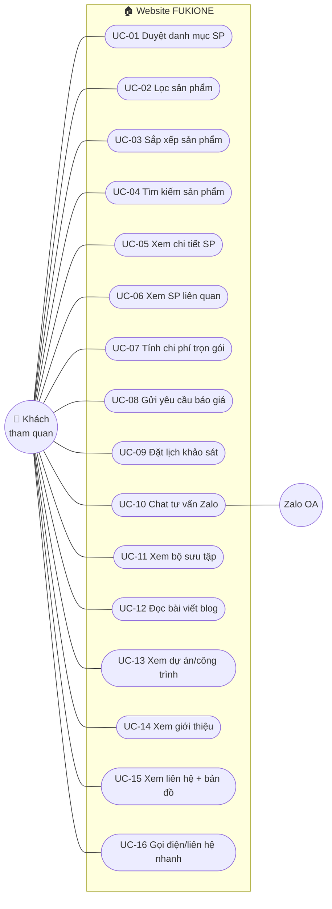
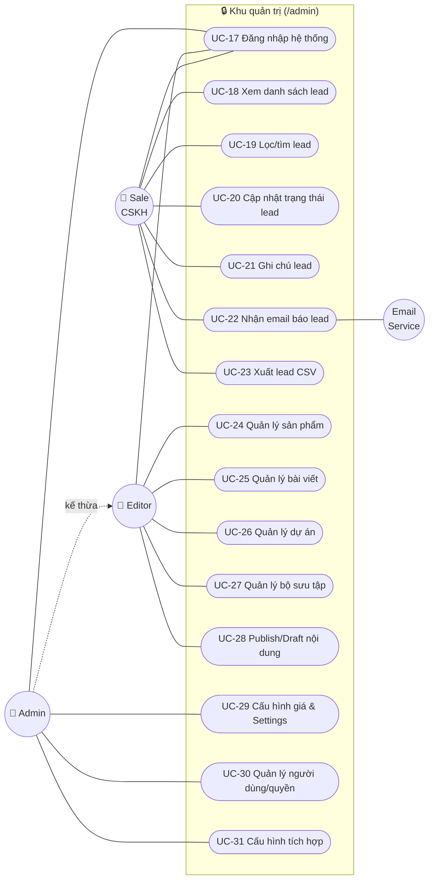
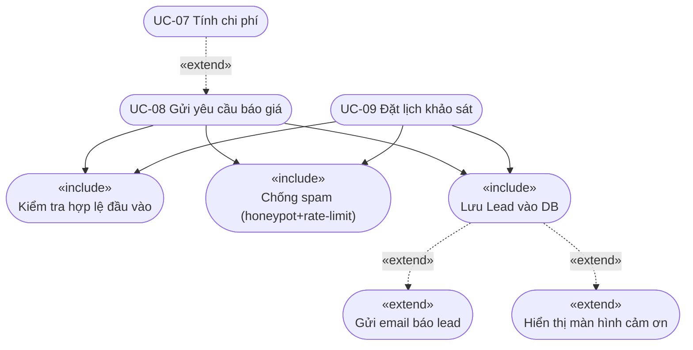

# Use Case — Website Sàn Gỗ FUKIONE (Phase 1)

**Ngày:** 2026-06-20
**Phạm vi:** Phase 1 — B2C lead-gen, Hà Nội
**Liên quan:** `2026-06-20-fukione-phase1-srs.md`

---

## 1. Tác nhân (Actors)

| Tác nhân | Loại | Mô tả |
|---|---|---|
| **Khách tham quan** (Visitor) | Chính | Người tiêu dùng HN tìm/mua sàn gỗ. Sau khi gửi form thì trở thành *Lead*. |
| **Sale / CSKH** | Chính | Nhân viên FUKIONE tiếp nhận & chốt lead. |
| **Editor** (Quản trị nội dung) | Chính | Quản lý sản phẩm, bài viết, dự án. |
| **Admin** | Chính | Toàn quyền: cấu hình, phân quyền, tích hợp. |
| **Email Service (Resend)** | Phụ | Hệ thống gửi email thông báo lead. |
| **Google** (Maps/GA4/Search) | Phụ | Bản đồ, phân tích, lập chỉ mục. |
| **Zalo OA** | Phụ | Kênh chat tư vấn. |

> Sale, Editor, Admin đều kế thừa use case **Đăng nhập** (generalization).

---

## 2. Sơ đồ Use Case — Nhóm Khách hàng (Visitor)

---

## 3. Sơ đồ Use Case — Nhóm Nội bộ (Sale / Editor / Admin)

> Admin có toàn bộ quyền của Editor (và xem được lead). Mũi tên đứt thể hiện **generalization** (Admin ⊇ Editor).

---

## 4. Quan hệ «include» / «extend»

Các use case lõi và phần dùng chung / mở rộng:

**Diễn giải:**
- **UC-07 → UC-08** (extend): sau khi tính chi phí, khách có thể tiếp tục gửi báo giá (số tạm tính, SP, diện tích được đính kèm vào lead).
- **UC-08 / UC-09 include**: *Kiểm tra hợp lệ*, *Chống spam*, *Lưu Lead* — bắt buộc, dùng chung.
- **Lưu Lead extend**: *Gửi email* và *Màn hình cảm ơn* — chạy sau khi lead đã lưu an toàn (lead không phụ thuộc email — NFR-REL-01).

---

## 5. Bảng tổng hợp & đếm Use Case

| # | Use Case | Tác nhân chính | FR liên quan | Ưu tiên |
|---|---|---|---|---|
| UC-01 | Duyệt danh mục SP | Khách | FR-CAT-01 | M |
| UC-02 | Lọc sản phẩm | Khách | FR-CAT-02/03 | M |
| UC-03 | Sắp xếp sản phẩm | Khách | FR-CAT-04 | S |
| UC-04 | Tìm kiếm sản phẩm | Khách | FR-CAT-09 | S |
| UC-05 | Xem chi tiết SP | Khách | FR-CAT-05/06/07 | M |
| UC-06 | Xem SP liên quan | Khách | FR-CAT-08 | S |
| UC-07 | Tính chi phí trọn gói | Khách | FR-CALC-01..07 | M |
| UC-08 | Gửi yêu cầu báo giá | Khách → Lead | FR-LEAD-01/04/05/06 | M |
| UC-09 | Đặt lịch khảo sát | Khách → Lead | FR-LEAD-03 | M |
| UC-10 | Chat tư vấn Zalo | Khách | FR-INT-01 | M |
| UC-11 | Xem bộ sưu tập | Khách | FR-CONT-04 | S |
| UC-12 | Đọc bài viết blog | Khách | FR-CONT-03 | M |
| UC-13 | Xem dự án/công trình | Khách | FR-CONT-02 | M |
| UC-14 | Xem giới thiệu | Khách | FR-CONT-01 | M |
| UC-15 | Xem liên hệ + bản đồ | Khách | FR-CONT-05, FR-INT-04 | M |
| UC-16 | Gọi điện/liên hệ nhanh | Khách | FR-CONT-06 | M |
| UC-17 | Đăng nhập hệ thống | Sale/Editor/Admin | FR-CMS-05 | M |
| UC-18 | Xem danh sách lead | Sale | FR-CMS-04 | M |
| UC-19 | Lọc/tìm lead | Sale | FR-CMS-04 | M |
| UC-20 | Cập nhật trạng thái lead | Sale | FR-CMS-04 | M |
| UC-21 | Ghi chú lead | Sale | FR-CMS-04 | M |
| UC-22 | Nhận email báo lead | Sale | FR-NOTI-01/02 | M |
| UC-23 | Xuất lead CSV | Sale | FR-CMS-07 | C |
| UC-24 | Quản lý sản phẩm | Editor | FR-CMS-01 | M |
| UC-25 | Quản lý bài viết | Editor | FR-CMS-02 | M |
| UC-26 | Quản lý dự án | Editor | FR-CMS-02 | M |
| UC-27 | Quản lý bộ sưu tập | Editor | FR-CMS-02 | S |
| UC-28 | Publish/Draft nội dung | Editor | FR-CMS-06 | S |
| UC-29 | Cấu hình giá & Settings | Admin | FR-CMS-03 | M |
| UC-30 | Quản lý người dùng/quyền | Admin | FR-CMS-05 | M |
| UC-31 | Cấu hình tích hợp | Admin | FR-INT-02/03, FR-NOTI-02 | M |

### Đếm theo tác nhân
| Tác nhân | Số use case |
|---|---|
| Khách tham quan | **16** (UC-01 → UC-16) |
| Sale / CSKH | **7** (UC-17*, UC-18 → UC-23) |
| Editor | **5** (UC-24 → UC-28) |
| Admin | **3** (UC-29 → UC-31) |
| **Tổng (không trùng)** | **31 use case** |

\* UC-17 (Đăng nhập) dùng chung cho Sale/Editor/Admin — đếm 1 lần.

### Đếm theo độ ưu tiên (MoSCoW)
| Mức | Số UC | Danh sách |
|---|---|---|
| **Must** | 22 | UC-01,02,05,07,08,09,10,12,13,14,15,16,17,18,19,20,21,22,24,25,26,29,30,31 (tối thiểu go-live) |
| **Should** | 6 | UC-03,04,06,11,27,28 |
| **Could** | 1 | UC-23 |

> Lưu ý: bảng Must liệt kê các UC lõi; tổng các nhóm có thể chênh do một số UC gộp nhiều FR. Con số chốt: **31 use case**, trong đó ~22 thuộc nhóm bắt buộc cho lần go-live đầu tiên.

---

## 6. Use case lõi (mô tả luồng — ví dụ UC-08)

**UC-08 — Gửi yêu cầu báo giá**
- **Tác nhân:** Khách tham quan
- **Tiền điều kiện:** Đang ở trang SP / kết quả calculator / trang báo giá.
- **Luồng chính:**
  1. Khách bấm "Nhận báo giá".
  2. Hệ thống mở form (Tên*, SĐT*, Email?, Ghi chú?), tự đính SP/diện tích/tạm tính nếu đến từ calculator.
  3. Khách nhập & gửi.
  4. Hệ thống «include» kiểm tra hợp lệ + chống spam.
  5. Hệ thống «include» lưu Lead vào DB (status=`new`).
  6. «extend» gửi email cho sale; «extend» hiển thị màn hình cảm ơn.
- **Luồng phụ:**
  - 4a. Dữ liệu sai → báo lỗi inline, giữ nguyên dữ liệu đã nhập.
  - 6a. Email lỗi → lead vẫn lưu, hệ thống retry + ghi log (NFR-REL-01/02).
- **Hậu điều kiện:** Lead tồn tại trong CRM, sale nhận được thông báo.

> Các UC lõi khác (UC-07, UC-09, UC-20) sẽ được đặc tả luồng chi tiết tương tự khi bước sang giai đoạn lập kế hoạch/triển khai.
